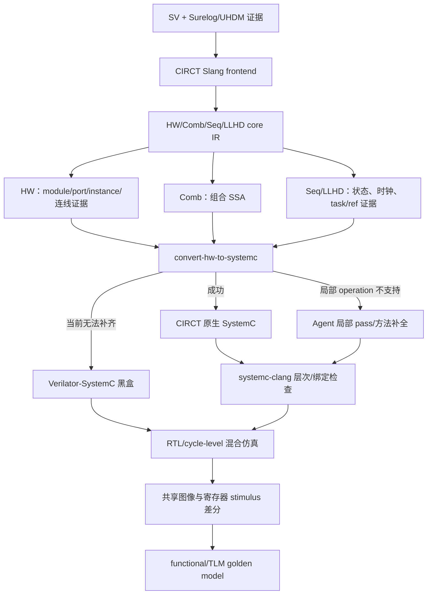

# UHDM + CIRCT 分阶段 SystemC 与 Verilator 混合仿真流程

## 1. 适用目标

这条流程用于老师最新提出的 DSC 路线：结构不能由大模型猜；先利用 UHDM 与 CIRCT 固化模块、
端口、实例、连线和 SSA 行为证据，再判断 CIRCT 的 SystemC 后端能走到哪一步。后端不能完成的
模块，优先使用 Verilator `--sc` 生成的 cycle-level 模型作黑盒；只有明确定位到局部 operation
缺口后，才允许 Agent 补 CIRCT pass 或局部 SystemC method。

它不把 Verilator 模型说成纯软件 function model，也不把“编译成功”说成“图像压缩功能正确”。



## 2. 输入与证据职责

| 证据 | 负责回答 | 不能证明 |
|---|---|---|
| Surelog 日志 | elaboration 是否干净、实例总数、最大深度 | 附带 JSON exporter 是否完整 |
| UHDM hierarchy JSON | exporter 实际导出的模块与调用关系 | generate scope 被漏掉时的完整层次 |
| CIRCT HW IR | 展开后的模块、端口类型、`hw.instance` 与 SSA | 原生 SystemC exporter 一定支持这些 operation |
| Verilator `--sc` | RTL 可生成并编译为 cycle-level C++/SystemC 模型 | RTL 功能正确、与 golden 等价 |
| systemc-clang | Agent/原生 SystemC 的模块、端口、绑定、process 静态结构 | 运行时数据正确 |
| 共同 stimulus + golden | 最终输出是否一致 | 未覆盖输入空间上的普遍正确性 |

`verilog_dsc` 附带的 exporter 只递归 `vpiModule`。本次输入的 JSON 有 25 个层次节点，Surelog
日志却记录 261 个实例，因此流程将 `canonical_hierarchy_ready` 置为 false，并保留 CIRCT 的
`hw.instance` 清单作为第二结构视角。Agent 不得在这两个证据之外臆造连接。

## 3. 五个阶段

### 3.1 全量 frontend

先按 `surelog.f` 原样解析所有源文件，目的是暴露输入包本身的问题。此阶段失败不会被静默过滤。

### 3.2 顶层可达 frontend

只有同时满足以下条件，才允许排除一个坏文件后继续：

1. 文件在原 filelist 中；
2. 其中定义出现在 UHDM definition 清单；
3. 该定义未出现在附带 JSON 的实例节点；
4. 排除原因写入机器报告。

当前唯一排除项是 `dsce_quant.sv`：它定义的 `dsce_qaunt` 未实例化，且使用未声明的
`tDSC_SAMPLE`、`kDSC_SAMPLE_INIT`。原始失败仍保留在 `01_frontend_all_sources.stderr.log`。

### 3.3 HW / Comb / Seq / LLHD 分区

成功生成 core IR 后，脚本逐个 `hw.module` 提取：

- 输入、输出和 aggregate 端口类型；
- `hw.instance` 的父模块、实例名和目标模块；
- `comb.*`、`seq.*`、`llhd.*` operation 计数；
- 结构-only、组合、时序和 LLHD 模块集合。

该清单同时写入 Agent context。Agent 只得到失败 operation 的受影响模块和允许动作，不得到
“可以改层次”的权限。

### 3.4 CIRCT 原生 SystemC

顺序执行：

```text
circt-verilog --ir-hw
circt-opt --canonicalize --symbol-dce
circt-opt --convert-hw-to-systemc
circt-translate --export-systemc
```

每一阶段都保存 argv、返回码、stdout/stderr、产物哈希和大小。转换失败时分类首个非法 operation，
后续 emission 标为 blocked，绝不生成伪造 C++。

### 3.5 Verilator 黑盒与混合计划

对配置中的 `dsc_encoder`、`dsce_engine`、`dsce_apb` 分别执行：

```text
verilator --cc --sc --timing --trace ...
make -f V<module>.mk V<module>__ALL.a
```

脚本验证头文件和静态库真实存在，并把 Verilator SystemC 端口与 CIRCT HW 端口集合比较。混合
替换顺序由小到大：`dsce_apb → dsce_engine → dsc_encoder`。每替换一级都必须重跑同一份输入并
与 functional/TLM golden 比较；没有 stimulus 时只能报告“黑盒可构建”。

## 4. 运行命令

所有真实 EDA 验证在 Ubuntu x86_64 执行：

```bash
dscflow circt run \
  --config configs/staged_circt.json \
  --input-root /path/to/verilog_dsc \
  --output-root .work/runs/staged-circt \
  --run-id x86-YYYYMMDD \
  --circt-root /path/to/circt \
  --circt-library-path /path/to/runtime-libraries
```

第一次运行会检查三个项目 Skill：`eda-tool-assistant`、`modeling-systemverilog` 和
`modeling-systemc-tlm`。若缺失，报告提供
`git clone --branch dev https://github.com/trv3wood/eda-sandbox.git ~/.codex/vendor/eda-sandbox`
安装命令；已有 Skill 时只记录缓存路径，不重新安装。

## 5. 产物

```text
run/
├── 00_input/             输入、UHDM 完整性与 Skill 证据
├── 01_tools/             工具路径、版本和哈希
├── 02_circt/             core IR、operation 清单和逐阶段日志
├── 03_verilator/         每个黑盒的头文件、库与编译日志
├── 04_agent_context/     受约束的局部修复输入
├── 05_hybrid/            混合替换顺序和下一门禁
└── report.json           顶层机器报告
```

## 6. 当前边界

当前包没有共同的图像输入、寄存器配置序列和参考压缩输出，也没有官方 DSC C model。因此本流程
已经完成结构与可构建性验证，但功能差分仍是显式未执行项。后续拿到 golden 后，应先验证顶层
纯 function/TLM model，再以相同 stimulus 验证数据流 SystemC，最后逐模块替换 Verilator 模型。

## 7. CIRCT 官方接口参考

- [HW-to-SystemC pass 列表](https://circt.llvm.org/docs/Passes/)
- [SystemC dialect 与 exporter](https://circt.llvm.org/docs/Dialects/SystemC/)
- [CIRCT firtool-1.155.0 release](https://github.com/llvm/circt/releases/tag/firtool-1.155.0)
